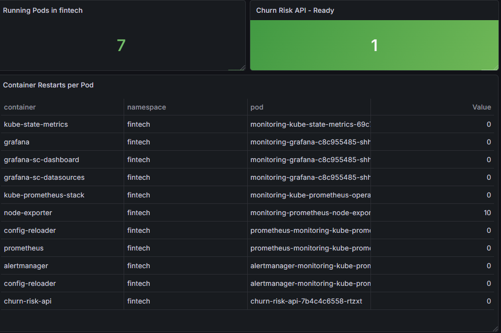

# fintech-homelab

A personal learning project exploring Kubernetes and Terraform through a fintech lens.

The application is a churn risk API — a REST service that scores bank customers by their likelihood to leave. The domain logic is drawn from real experience: seven years in DNB, including a role on a cross-functional customer retention team where behavioral data was used to identify at-risk customers and intervene before they left.

The infrastructure side explores three deployment approaches for the same application, from raw Kubernetes manifests to Terraform IaC to a combined workflow where each tool does what it does best.

---

## Application

The API exposes a single prediction endpoint. It takes five behavioral signals and returns a risk score and level.

**Risk factors:**
- `months_since_login` — inactivity is the strongest churn signal in retail banking
- `num_products` — customers with a single product are far easier to lose
- `has_mortgage` — home loans are the strongest retention factor
- `num_complaints` — escalated dissatisfaction, drawn directly from customer retention experience
- `age_years` — newer customers churn more often than established ones

**Example request:**
```json
POST /predict
{
  "months_since_login": 5,
  "num_products": 1,
  "has_mortgage": false,
  "num_complaints": 2,
  "age_years": 1
}
```

**Example response:**
```json
{
  "risk_level": "high",
  "risk_score": 100
}
```

---

## Tech Stack

| Layer | Technology |
|---|---|
| Application | Python, Flask |
| Container | Docker |
| Orchestration | Kubernetes (Docker Desktop) |
| IaC | Terraform (hashicorp/kubernetes provider) |
| Scripting | PowerShell |
| Version control | Git |

---

## Prerequisites

- Docker Desktop with Kubernetes enabled
- Terraform installed
- `kubectl` available in PATH
- PowerShell

---

## Deployment

This project intentionally implements three deployment approaches to explore how the tools differ and where each fits.

### Approach 1: Kubernetes (kubectl)

Deploys directly using raw Kubernetes manifests. Terraform plays no role here.

```powershell
.\scripts\deploy-k8s.ps1
```

This builds the Docker image, applies the namespace, deployment and service, waits for rollout, and starts port-forwarding on `localhost:5000`.

To tear down:
```powershell
.\scripts\destroy-k8s.ps1
```

### Approach 2: Terraform

Deploys the full stack — namespace, deployment and service — through the Terraform Kubernetes provider.

```powershell
.\scripts\deploy-terraform.ps1
```

To tear down:
```powershell
.\scripts\destroy-terraform.ps1
```

### Approach 3: Combined (Terraform + Kubernetes)

The most production-representative approach. Terraform creates the namespace (infrastructure), Kubernetes manifests deploy the application into it. Each tool owns what it does best.

```powershell
.\combined\deploy_com.ps1
```

---

## Monitoring

Grafana and Prometheus are deployed via Helm into the `fintech` namespace alongside the application.

```powershell
helm repo add prometheus-community https://prometheus-community.github.io/helm-charts
helm repo update
helm install monitoring prometheus-community/kube-prometheus-stack --namespace fintech
```

Access Grafana:

```powershell
kubectl port-forward -n fintech svc/monitoring-grafana 3000:80
```

Open `http://localhost:3000`. Credentials are stored as a Kubernetes secret:

```powershell
kubectl get secret --namespace fintech monitoring-grafana -o jsonpath="{.data.admin-password}" | ForEach-Object { [System.Text.Encoding]::UTF8.GetString([System.Convert]::FromBase64String($_)) }
```

The dashboard monitors the `fintech` namespace with three panels:

- **Running Pods** — total pods registered in the namespace
- **Churn Risk API - Ready** — green when the application is up, red if it crashes
- **Container Restarts per Pod** — `churn-risk-api` shows 0 restarts; `node-exporter` crashes repeatedly because Docker Desktop does not expose host metrics, a known environment limitation that does not affect the application



## What I learned

Setting this up on WSL with no external network access forced a deeper understanding of how Kubernetes pulls images, how Terraform resolves providers, and what actually happens under the hood when a namespace gets stuck in `Terminating` for 90 minutes.

Working through three deployment approaches clarified something that documentation doesn't make obvious: Terraform and kubectl are not alternatives. A common production pattern is Terraform for cluster provisioning and infrastructure, Kubernetes manifests for application deployment. Using them separately first, then combining them, made this concrete rather than theoretical.


Adding Grafana and Prometheus via Helm revealed another layer: observability is infrastructure too. The dashboard exposes a real environment limitation: `node-exporter` crashes on Docker Desktop because host metrics are not accessible, while the application itself runs stably with zero restarts. Knowing the difference between a monitoring failure and an application failure matters.

---

## Project Structure

```
fintech-homelab/
├── app/
│   ├── app.py                  # Flask churn risk API
│   ├── Dockerfile
│   └── requirements.txt
├── k8s/                        # Raw Kubernetes manifests
│   ├── namespace.yaml
│   ├── deployment.yaml
│   └── service.yaml
├── terraform/                  # Terraform deploys full stack
│   ├── main.tf
│   ├── variables.tf
│   └── terraform.tfvars.example
├── combined/                   # Terraform (infra) + kubectl (app)
│   ├── terraform/
│   │   └── main.tf
│   ├── k8s/
│   │   ├── deployment.yaml
│   │   └── service.yaml
│   └── deploy_com.ps1
└── scripts/
    ├── deploy-k8s.ps1
    ├── destroy-k8s.ps1
    ├── deploy-terraform.ps1
    └── destroy-terraform.ps1
```